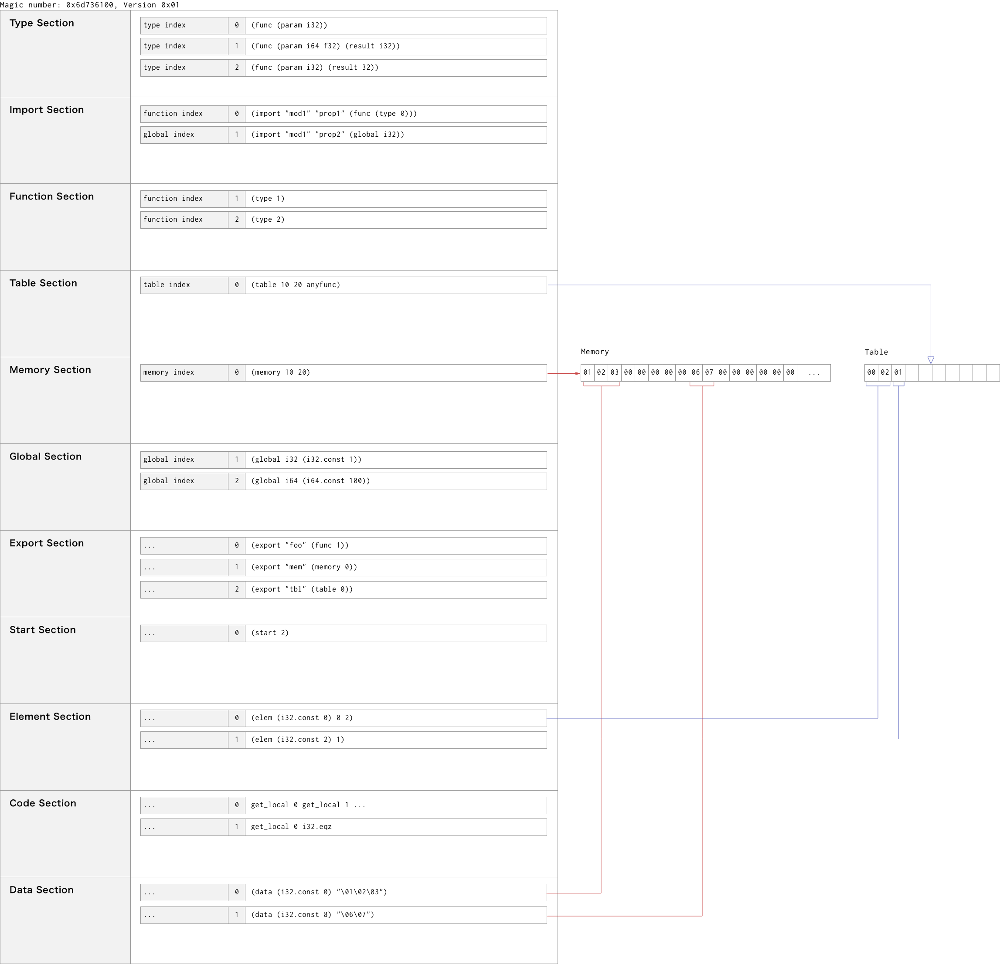

# WebAssembly バイナリ表現

この章ではwasmモジュールのバイナリ表現について解説します。まずは内部で使用されるデータ型、次にモジュールの構造について見ていきます。この章の内容は公式の資料を翻訳、補足したものです。

## データ型

### 数値（Numbers）

#### `uintN`

符号なしの *N* bitの整数値、リトルエンディアンで表現されます。`uint8`、 `uint16`、 `uint32` の3種類が使用されています。

#### `veruintN`
[LEB128](https://en.wikipedia.org/wiki/LEB128)で表現される *N* bitの符号なし整数です。

注：現在 `varuint1`, `veruint7`, `varuint32`のみ使用されてます。前者2つは将来的な拡張機能と互換性のために使用されています。

#### `verintN`
符号付きLEB128で表現される *N* bitの整数です。

注：現在 `varint7`, `varint32`, `varint64`が使用されています。

### オペコード（Instruction Opcodes）

MVPでは、オペコードの個数はは256以下であるため1バイトで表現されます。将来的にSIMDやアトミック操作の命令を追加すると256を超えるため、拡張スキーマが必要になります。マルチバイトオペコード用に1バイトのプレフィックス値を策定中とのことです。

### 言語型（Language Types）

全ての型（型コンストラクタを表す）は先頭の負の`varint7`値によって識別されます。

オペコード(`varint7`値) | オペコード(バイト値)  | Type constructor
:---|:---|:---
`-0x01`|`0x7f`|`i32`
`-0x02`|`0x7e`|`i64`
`-0x03`|`0x7d`|`f32`
`-0x04`|`0x7c`|`f64`
`-0x10`|`0x70`|`anyfunc`
`-0x20`|`0x60`|`func`
`-0x40`|`0x40`|空の`block_type`を表現する擬似的な型

この中でいくつかは追加のフィールドが続くものがあります（後述）。

注：将来的な拡張性のために隙間の数値は予約されています。符号付きの数値（つまりここで負の値）を使っているは1バイトでtype sectionへのインデックス（後述）を設定できるようにするためです。型システムの将来的な拡張に関連しています。

#### `value_type`
値型を表す`varint7`値。`i32`、`i64`、`f32`、`f64`の中の一つです。

#### `block_type`
ブロック（後述）が返す型を表す`varint7`値。ブロックが値を返す場合は`value_type`、何も返さない場合は`-0x40`が設定されます。

#### `elem_type`
テーブル（後述）中の要素の型を表す`varint7`値。MVPでは`anyfunc`のみ有効です。

注：将来的に他の要素も有効になるでしょう。

#### `func_type`
関数シグネチャーを表します。この型コンストラクタには以下の記述が追加されます。

フィールド | 型 | 説明
:---|:---|:---
form | `varint7` | 上の表で定義した`func`型コンストラクタの値
param_count | varuint32 | 関数のパラメータ数
param_types | `value_type*` | 関数のパラメータの型(パラメータ数だけ用意)
return_count | `varuint1` | 関数の返り値の数
return_type | `value_type?` | 関数の返り値の型(return_countが1なら)

注：将来的に`return_count`と`return_type`は複数の値を許容するために一般化されるかもしれません。

### 他の型（Other Types）

#### `global_type`
グローバル変数の情報を表します。

フィールド | 型 | 説明
:---|:---|:---
content_type | `value_type` | 値の型
mutability | `varuint1` | `0`ならイミュータブル。`1`ならミュータブル

#### `table_type`
テーブルの情報を表します。

フィールド | 型 | 説明
:---|:---|:---
element_type | `elem_type` | 要素の型
limits | `resizable_limits` | 後述

#### `memory_type`
メモリーの情報を表します。

フィールド | 型 | 説明
:---|:---|:---
limits | `resizable_limits` | 後述

#### `external_kind`
インポートまたはモジュール内で定義された定義の種類を表す1バイトの符号なし整数値。

Value | Description
:---|:---
`0`| インポートまたはモジュール内で定義された `Function`
`1`| インポートまたはモジュール内で定義された `Table`
`2`| インポートまたはモジュール内で定義された `Memory`
`3`| インポートまたはモジュール内で定義された `Global`

#### `resizable_limits`
テーブル、メモリーの初期、最大サイズを表します。テーブルの場合は要素数、メモリーの場合は64KBを1単位とします。

フィールド | 型 | 説明
:---|:---|:---
flags | `varuint1` | maximumフィールドがあるかどうか
initial | `varuint32` | 初期の長さ
maximum | `varuint32?` | 最大値（`flags`が`1`ならこのフィールドがある）

注： `flags` フィールドは`varuint32`に変わる可能性があります。例えばスレッド間で共有するためのフラグが含まれたりする。

#### `init_expr`
イニシャライザー。code section（後述）で用いられている式と`end`オペコードによって構成されます。

注：イニシャライザーに含まれる`get_global`はインポートされたイミュータブルなグローバル変数のみ参照でき、全ての`init_expr`はimport sectionの後でのみ使用できます。

## モジュール構造（Module structure）

wasmモジュールの現在のプロトタイプです。このフォーマットは[v8-native prototype format](https://docs.google.com/document/d/1-G11CnMA0My20KI9D7dBR6ZCPOBCRD0oCH6SHCPFGx0/edit)を元にして作られています。

### 高レベル構造（High-level structure）



モジュールは以下の2つのフィールドから開始します。

フィールド | 型 | 説明
:---|:---|:---
magic number | `uint32` | マジックナンバー `0x6d736100` （`"\0asm"`）
version | `uint32` | バージョンナンバー（`0x1`）。

モジュールプリアンブルのあとに一連のセクションが続きます。各セクションは既知のセクションまたはカスタムセクションを表す1バイトのセクションコードによって識別されます。そして、セクションの長さ、ペイロードが次に続きます。既知のセクションは非ゼロなidを持ちます。カスタムセクションのidは`0`で、その後にペイロードの一部として識別文字列が続きます。カスタムセクションはWebAssemblyの実装では無視されるので内部でのバリデーションエラーがあってもモジュールが無効になるわけではありません。

フィールド | 型 | 説明
:---|:---|:---
id | `varuint7` | セクションコード
payload_len | `varuint32` | セクションのバイト長
name_len | `varuint32?` | セクション名のバイト長。`id == 0`のときだけ存在します
名前 | `bytes?` | セクション名の本体。`id == 0`のときだけ存在します
payload_data | セクションの中身。長さは `payload_len - sizeof(名前) - sizeof(name_len)`。

既知のセクションはオプショナルで最大で1個だけです。カスタムセクションは全て同じidを持ちユニークでない名前をつけることができます。以下の表で定義される既知のセクションは順不同で現れない場合もあります。各セクションの`payload_data`にエンコードされた内容が入ります。

セクション名 | コード | 説明
:---|:---|:---
Type | `1` | 関数シグネチャー宣言
Import | `2` | インポート宣言
Function | `3` | 関数宣言
Table | `4` | 間接的な関数テーブルと他のテーブル
Memory | `5` | メモリー属性
Global | `6` | グローバル宣言
Export | `7` | エクスポート
Start | `8` | 開始関数宣言
Element | `9` | 要素セクション
Code | `10` | 関数本体(code)
Data | `11` | データセグメント

最後のセクションの最終バイトはモジュールの最終バイトと一致する必要があります。最小のモジュールは8バイトです (`magic number`, `version`のあとに何もない状態)。

### Type section

Type sectionでは、モジュールで使用されている全ての関数シグネチャーを宣言します。

フィールド | 型 | 説明
:---|:---|:---
count | `varuint32` | エントリー数
entries | `func_type*` | 関数シグネチャー列

注：将来的に、他の型を持つエントリーもここに入る可能性があります。`func_type`の`form`フィールドで識別できます。

### Import section
Import sectionではモジュールで使用されている全てのインポートを宣言します。

フィールド | 型 | 説明
:---|:---|:---
count | `varuint32` | エントリー数
entries | `import_entry*` | import entry（後述）列

#### Import entry

フィールド | 型 | 説明
:---|:---|:---
module_len | `varuint32` | モジュール文字列の長さ
module_str | `bytes` | `module_len`バイトのモジュールの文字列
フィールド_len | `varuint32` | フィールド名の長さ
フィールド_str | `bytes` | `フィールド_len`バイトのフィールド名
kind | `external_kind` | インポートされた定義の種類

`kind`の種類によって以下の項目が続きます。`kind`が`Function`の場合は

フィールド | 型 | 説明
:---|:---|:---
type | `varuint32` | type sectionにある関数シグネチャーのインデックス

`kind`が`Table`の場合は

フィールド | 型 | 説明
:---|:---|:---
type | `table_type` | インポートされたテーブルの情報

`kind`が`Memory`の場合は

フィールド | 型 | 説明
:---|:---|:---
type | `memory_type` | インポートされたメモリーの情報

`kind`が`Global`の場合は

フィールド | 型 | 説明
:---|:---|:---
type | `global_type` | インポートされたグローバル変数の情報

注：MVPではイミュータブルなグローバル変数のみインポートできます。

### Function section

Function sectionではモジュール内のすべての関数シグネチャーを宣言します（関数の定義はcode sectionに置かれます）。

フィールド | 型 | 説明
:---|:---|:---
count | `varuint32` | エントリー数
types | `varuint32*` | type sectionに置いてある対象の`func_type`のインデックス列

### Table section

Table sectionではモジュール内で使用するテーブル（参照を要素として持つ型付き配列）を定義します。

フィールド | 型 | 説明
:---|:---|:---
count | `varuint32` | モジュールに定義されているテーブルの数
entries | `table_type*` | `table_type`エントリー列

注：MVPでは、テーブルの数は1以下でなければいけません。`table_type`で使用できる型は`anyfunc`だけで、関数テーブルとして機能します。

### Memory section

Memory sectionではモジュール内で使用する線形メモリーを定義します。

フィールド | 型 | 説明
:---|:---|:---
count | `varuint32` | モジュールで定義されているメモリーの数
entries | `memory_type*` | `memory_type` エントリー列

注：初期値、最大値のフィールドは[WebAssembly pages](http://webassembly.org/docs/semantics/#linear-memory)参照。
MVPでは、メモリーの数は1以下でなければいけません。

### Global section

Global sectionではモジュール内で使用するグローバル変数を定義します。

フィールド | 型 | 説明
:---|:---|:---
count | `varuint32` | グローバル変数エントリーの数
globals | `global_variable*` | 後述のグローバル変数列

#### Global entry

各`global_variable`は`global_type`によって型とミュータビリティー、`init_expr`によって初期値が与えられます。

フィールド | 型 | 説明
:---|:---|:---
type | `global_type` | 変数の型
init | `init_expr` | グローバル変数のイニシャライザー

注：MVPではイミュータブルなグローバル変数だけエクスポートできます。

### Export section

Export sectionではモジュール外にエクスポートするエントリーを宣言します。

フィールド | 型 | 説明
:---|:---|:---
count | `varuint32` | エントリー数
entries | `export_entry*` | 後述のエクスポートエントリー列

#### Export entry

フィールド | 型 | 説明
:---|:---|:---
フィールド_len | `varuint32` | フィールド名の長さ
フィールド_str | `bytes` | `フィールド_len`バイトのフィールド名
kind | `external_kind` | エクスポートされた定義の種類
index | `varuint32` | 対応するindex space（後述）へのインデックス

例えば、`kind`が`Function`のときはindexはfunction section中でのインデックス(function index)になります。MVPではメモリ、テーブルは0だけです。

### Start section

Start sectionではモジュールのインスタンス化が完了したときに呼ばれる関数を宣言します。

フィールド | 型 | 説明
:---|:---|:---
index | `varuint32`|開始する関数のfunction index

### Element section

Element sectionではモジュールをインスタンス化するときに初期値としてテーブルに設定する要素を宣言します。

フィールド | 型 | 説明
:---|:---|:---
count| `varuint32`|エレメントセグメントの数
entries|`elem_segment*`|後述のエレメントセグメント列

`elem_segment`は以下ような構造を持ちます。

フィールド | 型 | 説明
:---|:---|:---
index| `varuint32`|table index（MVPでは0）
offset| `init_expr`|要素の場所のオフセットを返すイニシャライザー（`i32`値）
num_elem|`varuint32`|要素数
elems|`varuint32*`|function index列

### Code section

Code sectionにはモジュール内の全ての関数の本体が含まれています。function sectionで宣言された関数の数と関数本体の定義は必ず一致しなければいけません。`i`番目の関数宣言は`i`番目の関数本体に対応しています。

フィールド | 型 | 説明
:---|:---|:---
count|`varuint32`|`function_body`の数.
bodies|`function_body*`|関数本体の列（Function bodiesで説明）

### Data section

Data sectionではモジュールをインスタンス化するときにロードされる初期化データを宣言します。

フィールド | 型 | 説明
:---|:---|:---
count|`varuint32|データセグメントの数
entries|`data_segment*`|後述のデータセグメント列

`data_segment`は以下のような構造を持ちます。

フィールド | 型 | 説明
:---|:---|:---
index|`varuint32`|線形メモリーのインデックス（MVPでは0）
offset|`init_expr`|データの場所のオフセットを返すイニシャライザー（`i32`値）
size|`varuint32`|`data`のバイト数
data|`bytes`|データ本体

### 名前 section

名前 sectionはカスタムセクションの1つです。`名前`フィールドに`"名前"`が設定されています。全てのカスタムセクション同様、このセクションでのバリデーションエラーは全体のモジュールには影響しません。
名前 sectionは（あれば）データセクションのあとに1回だけ現れます。wasmモジュールやその他開発環境で表示する場合、名前 sectionで定義される関数名やローカル変数名はWebAssemblyのテキスト表現などで使用されることが期待されます。影響しないのでここでは構造についての説明は省略します。

## 関数本体（Function Bodies）

関数本体は一連のローカル変数宣言の後にバイトコード命令が続きます。これは構造化されたスタックマシンとみなすことができます。命令はオペコード（Instruction Opcodes参照）と0個以上の即値オペランド（immediates）にエンコードされます。各関数本体は`end`オペコードで終わらなければなりません。

フィールド | 型 | 説明
:---|:---|:---
body_size|`varuint32`|関数本体のバイト数
local_count|`varuint32`|ローカル変数の数
locals|`local_entry`|ローカル変数列
code|`byte*`|関数のバイトコード
end|`byte|`0x0b`、関数本体の終了

### Local entry

各ローカルエントリーは与えられた型のローカル変数リストを宣言します。同じ型のエントリーを複数持つのはokです。

フィールド | 型 | 説明
:---|:---|:---
count |`varuint32`|ローカル変数の数
type|`value_type`|変数の型

## オペコード一覧

wasmで定義されているオペコードを紹介します。オペコードがオペランドを受け取る場合は基本的にN番目を`opN`とします。

### Control flow operators

名前 | オペコード | 即値 | 説明
:---|:---|:---|:---
`unreachable`|`0x00`||即例外を発生
`nop`|`0x01`||なにもしないオペコード
`block`|`0x02`|sig:`block_type`|式のシーケンスを開始して、0個か1個の値をpush
`loop`|`0x03`|sig:`block_type`|ループできるブロックを作る
`if`|`0x04`|sig:`block_type`|if式。`op1 != 0`のときブロックに入る
`else`|`0x05`||ifに対応するelse式
`end`|`0x0b`||`block`、`if`、`loop`の終了
`br`|`0x0c`|relative_depth:`varuint32`|対象の親ブロックに対して分岐命令を行う（以下補足）
`br_if`|`0x0d`|relative_depth:`varuint32`|`br`の条件分岐あり版(以下補足)
`br_table`|`0x0e`|後述|後述
`return`|`0x0f`||関数から0個か1個の値を返す

#### 分岐命令について

`br`, `br_if`, `br_table` は分岐命令を行う対象のブロックによって挙動が変わります。`block`, `if` ブロックでは、対応する `end` に、`loop` ブロックではブロックの先頭に飛びます。

#### `br`

*relative_depth* のイメージ

```
block ;; 2
  block ;; 1
    block ;; 0
      br 1 ;; 現在のブロックからの深さを指定して分岐
    end
  end
end
```

blockが値をpushしない場合、オペランドを受け取りません。
blockが値をpushする場合、`op1`をpushします。

#### `br_if`

blockが値をpushしない場合、`op1 != 0` のとき分岐します。
blockが値をpushする場合、`op2 != 0` のとき分岐して、`op1` をpushします。

#### `br_table`

`br_table`オペコードは以下のような即値オペランドを持っています。

フィールド | 型 | 説明
:---|:---|:---
target_count | `varuint32` | target_tableのエントリー数
target_table|`varuint32*`|分岐する対象の親ブロック列
default_target|`varuint32`|デフォルトで分岐するブロック

ブロックが値をpushしない場合、`target_table`の`op1`番目のブロックに対して分岐命令を行います。ブロックが値をpushする場合は`br_if`などと同様に最初のオペランドがpushされます。入力値が範囲外の場合、`br_table`は`default_target`に指定されているブロックに対して分岐命令を行います。

注：オペコードの開いてる場所は将来のために予約されてます。

### Call operators

名前 | オペコード | 即値 | 説明
:---|:---|:---|:---
`call`|`0x10`|function_index: `varuint32`| function indexに対応する関数を呼ぶ
`call_indirect`|`0x11`|type_index: `varuint32`, reserved: `veruint1`| *type_index* の型の関数を間接的に呼ぶ

`call_indirect`は入力として、関数の引数分のオペランド（`type_index`から型を参照して引数の数を決定）とテーブルへのindexを受け取ります。テーブルのindexに置いてある`elem_segment`で指定されているfunction indexから関数を参照して呼び出します。
`reserved`は将来的に使うので予約されてます。MVPでは0です。

### Parametric operators

名前 | オペコード | 即値 | 説明
:---|:---|:---|:---
`drop`|`0x1a`||スタックの1番上の値をpop
`select`|`0x1b`|| `op3 != 0 ? op1 : op2`

### Variable access

名前 | オペコード | 即値 | 説明
:---|:---|:---|:---
`get_local`|`0x20`|local_index: `varuint32`| local_indexで指定されたローカル変数をスタックにpush
`set_local`|`0x21`|local_index: `varuint32`| `op1`の値をlocal_indexで指定されたローカル変数にセット
`tee_local`|`0x21`|local_index: `varuint32`| `op1`の値をlocal_indexで指定されたローカル変数にセットして、同じ値をpush
`get_global`|`0x23`|global_index: `varuint32`| global_indexで指定されたグローバル変数をスタックにpush
`set_global`|`0x24`|global_index: `varuint32`| `op1`の値をglobal_indexで指定されたグローバル変数にセット

### Memory-related operators

名前 | オペコード | 即値 | 説明
:---|:---|:---|:---
`i32.load`|`0x28`|`memory_immediate`| メモリーのオフセット`op1 + memory_immediate.offset`（後述）から32bit整数のデータを読み込んでスタックにpush
`i64.load`|`0x29`|`memory_immediate`| 略
`f32.load`|`0x2a`|`memory_immediate`| 略
`f64.load`|`0x2b`|`memory_immediate`| 略
`i32.load8_s`|`0x2c`|`memory_immediate`| 符号あり8bit整数を以下略
`i32.load8_u`|`0x2d`|`memory_immediate`| 符号なし8bit整数を以下略
`i32.load16_s`|`0x2e`|`memory_immediate`| 略
`i32.load16_u`|`0x2f`|`memory_immediate`| 略
`i64.load8_s`|`0x30`|`memory_immediate`| 略
`i64.load8_u`|`0x31`|`memory_immediate`| 略
`i64.load16_s`|`0x32`|`memory_immediate`| 略
`i64.load16_u`|`0x33`|`memory_immediate`| 略
`i64.load32_s`|`0x34`|`memory_immediate`| 略
`i64.load32_u`|`0x35`|`memory_immediate`| 略
`i32.store`|`0x36`|`memory_immediate`| メモリーのオフセット`op1 + memory_immediate.offset`（後述）に`op2`の値を書き込む
`i64.store`|`0x37`|`memory_immediate`| 略
`f32.store`|`0x38`|`memory_immediate`| 略
`f64.store`|`0x39`|`memory_immediate`| 略
`i32.store8`|`0x3a`|`memory_immediate`| 略
`i32.store16`|`0x3b`|`memory_immediate`| 略
`i64.store8`|`0x3c`|`memory_immediate`| 略
`i64.store16`|`0x3d`|`memory_immediate`| 略
`i64.store32`|`0x3e`|`memory_immediate`| 略
`current_memory`|`0x3f`|reserved: `varuint1`|メモリーのサイズを問い合わせる
`grow_memory`|`0x40`|reserved: `varuint1`|メモリーのサイズを拡張する

`memory_immediate` は以下のようにエンコードされます。

名前 | 型 | 説明
:---|:---|:---
flags | `varuint32` | フラグ。現在は最下位bitsがアライメントの値として使われている（`log2(alignment)`でエンコードされる）
offset | `varuint32` | オフセット値

flagsは`log2(alignment)`でエンコードされるので2の累乗である必要があります。追加のバリデーション基準として、アライメントは元々のアライメント以下でないといけません。`log(memory-access-size)`より下位のbitsは0である必要があります。これは将来のために予約されてます（例えば、共有メモリーの順序のために必要）。

`current_memory`、`grow_memory`オペコードの`reserved`は将来的に使われる予定です（MVPでは0）。

### Constants

名前 | オペコード | 即値 | 説明
:---|:---|:---|:---
`i32.const`|`0x41`|value:`varint32`|`i32`と解釈される定数値をpush
`i64.const`|`0x42`|value:`varint64`|`i64`と解釈される定数値をpush
`f32.const`|`0x43`|value:`uint32`|`f32`と解釈される定数値をpush
`f64.const`|`0x44`|value:`uint64`|`f64`と解釈される定数値をpush

### Comparison operators

真の場合は1、偽の場合は0をpushします。

名前 | オペコード | 即値 | 説明
:---|:---|:---|:---
`i32.eqz`|`0x45`||`op1 == 0`
`i32.eq`|`0x46`||`op1 == op2`（符号に依存しない）
`i32.ne`|`0x47`||`op1 != op2`（符号に依存しない）
`i32.lt_s`|`0x48`||`op1 < op2`（符号付き整数として）
`i32.lt_u`|`0x49`||`op1 < op2`（符号なし整数として）
`i32.gt_s`|`0x4a`||`op1 > op2`（符号付き整数として）
`i32.gt_u`|`0x4b`||`op1 > op2`（符号なし整数として）
`i32.le_s`|`0x4c`||`op1 <= op2`（符号付き整数として）
`i32.le_u`|`0x4d`||`op1 <= op2`（符号なし整数として）
`i32.ge_s`|`0x4e`||`op1 >= op2`（符号付き整数として）
`i32.ge_u`|`0x4f`||`op1 >= op2`（符号なし整数として）
`i64.eqz`|`0x50`||`op1 == 0`
`i64.eq`|`0x51`||`op1 == op2`（符号に依存しない）
`i64.ne`|`0x52`||`op1 != op2`（符号に依存しない）
`i64.lt_s`|`0x53`||`op1 < op2`（符号付き整数として）
`i64.lt_u`|`0x54`||`op1 < op2`（符号なし整数として）
`i64.gt_s`|`0x55`||`op1 > op2`（符号付き整数として）
`i64.gt_u`|`0x56`||`op1 > op2`（符号なし整数として）
`i64.le_s`|`0x57`||`op1 <= op2`（符号付き整数として）
`i64.le_u`|`0x58`||`op1 <= op2`（符号なし整数として）
`i64.ge_s`|`0x59`||`op1 >= op2`（符号付き整数として）
`i64.ge_u`|`0x5a`||`op1 >= op2`（符号なし整数として）
`f32.eq`|`0x5b`||`op1 == op2`
`f32.ne`|`0x5c`||`op1 != op2`
`f32.lt`|`0x5d`||`op1 < op2`
`f32.gt`|`0x5e`||`op1 > op2`
`f32.le`|`0x5f`||`op1 <= op2`
`f32.ge`|`0x60`||`op1 >= op2`
`f64.eq`|`0x61`||`op1 == op2`
`f64.ne`|`0x62`||`op1 != op2`
`f64.lt`|`0x63`||`op1 < op2`
`f64.gt`|`0x64`||`op1 > op2`
`f64.le`|`0x65`||`op1 <= op2`
`f64.ge`|`0x66`||`op1 >= op2`

### Numeric operators

名前 | オペコード | 即値 | 説明
:---|:---|:---|:---
`i32.clz`|`0x67`||`op1`の値について最上位bitから0が連続する回数（符号に依存しない）
`i32.ctz`|`0x68`||`op1`の値について最下位bitから0が連続する回数（符号に依存しない）
`i32.popcnt`|`0x69`||`op1`の値について1になっているbitの数（符号に依存しない）
`i32.add`|`0x6a`||`op1 + op2`（符号に依存しない）
`i32.sub`|`0x6b`||`op1 - op2`（符号に依存しない）
`i32.mul`|`0x6c`||`op1 * op2`（符号に依存しない, 下位32bitが結果になる）
`i32.div_s`|`0x6d`||`op1 / op2`符号あり（結果は0方向に切り捨て）
`i32.div_u`|`0x6e`||`op1 / op2`符号なし（切り捨て）
`i32.rem_s`|`0x6f`||`op1 % op2`符号付き（符号は割られる方が使われる）
`i32.rem_u`|`0x70`||`op1 % op2`符号なし
`i32.and`|`0x71`||`op1 & op2`（符号に依存しない）
`i32.or`|`0x72`||`op1 | op2`（符号に依存しない）
`i32.xor`|`0x73`||`op1 ^ op2`（符号に依存しない）
`i32.shl`|`0x74`||`op1 << op2`（符号に依存しない）
`i32.shr_s`|`0x75`||`op1 >> op2`（算術シフト）
`i32.shr_u`|`0x76`||`op1 >>> op2`（論理シフト）
`i32.rotl`|`0x77`||左ローテート（符号に依存しない）
`i32.rotr`|`0x78`||右ローテート（符号に依存しない）
`i64.clz`|`0x79`||最上位bitから0が連続する回数（符号に依存しない）
`i64.ctz`|`0x7a`||最下位bitから0が連続する回数（符号に依存しない）
`i64.popcnt`|`0x7b`||1になっているbitの数（符号に依存しない）
`i64.add`|`0x7c`||`op1 + op2`（符号に依存しない）
`i64.sub`|`0x7d`||`op1 - op2`（符号に依存しない）
`i64.mul`|`0x7e`||`op1 * op2`（符号に依存しない, 下位64bitが結果になる）
`i64.div_s`|`0x7f`||`op1 / op2`符号あり（結果は0方向に切り捨て）
`i64.div_u`|`0x80`||`op1 / op2`符号なし（切り捨て）
`i64.rem_s`|`0x81`||`op1 % op2`符号付き（符号は割られる方が使われる）
`i64.rem_u`|`0x82`||`op1 % op2`符号なし
`i64.and`|`0x83`||`op1 & op2`（符号に依存しない）
`i64.or`|`0x84`||`op1 | op2`（符号に依存しない）
`i64.xor`|`0x85`||`op1 ^ op2`（符号に依存しない）
`i64.shl`|`0x86`||`op1 << op2`（符号に依存しない）
`i64.shr_s`|`0x87`||`op1 >> op2`（算術シフト）
`i64.shr_u`|`0x88`||`op1 >>> op2`（論理シフト）
`i64.rotl`|`0x89`||左ローテート（符号に依存しない）
`i64.rotr`|`0x8a`||右ローテート（符号に依存しない）
`f32.abs`|`0x8b`||絶対値
`f32.neg`|`0x8c`||符号逆転
`f32.ceil`|`0x8d`||切り上げ
`f32.floor`|`0x8e`||切り捨て
`f32.trunc`|`0x8f`||0方向に丸める
`f32.nearest`|`0x90`||四捨五入（偶数丸め）
`f32.sqrt`|`0x91`||平方根
`f32.add`|`0x92`||`op1 + op2`
`f32.sub`|`0x93`||`op1 - op2`
`f32.mul`|`0x94`||`op1 * op2`
`f32.div`|`0x95`||`op1 / op2`
`f32.min`|`0x96`||2つの値のうち小さい方をpush。どちらかのオペランドがNaNの場合NaN
`f32.max`|`0x97`||2つの値のうち大きい方をpush。どちらかのオペランドがNaNの場合NaN
`f32.copysign`|`0x98`||1つ目の値の符号を2つ目の値にコピーしたものをpush
`f64.abs`|`0x99`||絶対値
`f64.neg`|`0x9a`||符号逆転
`f64.ceil`|`0x9b`||切り上げ
`f64.floor`|`0x9c`||切り捨て
`f64.trunc`|`0x9d`||0方向に丸める
`f64.nearest`|`0x9e`||四捨五入（偶数丸め）
`f64.sqrt`|`0x9f`||平方根
`f64.add`|`0xa0`||`op1 + op2`
`f64.sub`|`0xa1`||`op1 - op2`
`f64.mul`|`0xa2`||`op1 * op2`
`f64.div`|`0xa3`||`op1 / op2`
`f64.min`|`0xa4`||2つの値のうち小さい方をpush。どちらかのオペランドがNaNの場合NaN
`f64.max`|`0xa5`||2つの値のうち大きい方をpush。どちらかのオペランドがNaNの場合NaN
`f64.copysign`|`0xa6`||2つ目の値の符号を1つ目の値にコピーしたものをpush

### Conversions

型変換を行います。

`f64.convert_s/i32`では最近接偶数へ丸められます。そして、IEEE 754-2008で定義された無限大、負の無限大にオーバーフローする可能性があります。

浮動小数点数から整数に変換する命令（trunc）の場合、0方向に丸められた整数値となります。オーバーフローするような数値を変換しようとするとエラーとなります。

名前 | オペコード | 即値 | 説明
:---|:---|:---|:---
`i32.wrap/i64`|`0xa7`||64bit整数を受け取って、それの下位32bitをpush
`i32.trunc_s/f32`|`0xa8`||32bit浮動小数点数を受け取って、0方向に丸めた32bitの符号付き整数をpush
`i32.trunc_u/f32`|`0xa9`||32bit浮動小数点数を受け取って、0方向に丸めた32bitの符号なし整数をpush
`i32.trunc_s/f64`|`0xaa`||64bit浮動小数点数を受け取って、0方向に丸めた32bitの符号付き整数をpush
`i32.trunc_u/f64`|`0xab`||64bit浮動小数点数を受け取って、0方向に丸めた32bitの符号なし整数をpush
`i64.extend_s/i32`|`0xac`||32bit整数を64bit符号付き整数に拡張する
`i64.extend_u/i32`|`0xad`||32bit整数を64bit符号なし整数に拡張する
`i64.trunc_s/f32`|`0xae`||32bit浮動小数点数を受け取って、0方向に丸めた64bitの符号付き整数をpush
`i64.trunc_u/f32`|`0xaf`||32bit浮動小数点数を受け取って、0方向に丸めた64bitの符号なし整数をpush
`i64.trunc_s/f64`|`0xb0`||64bit浮動小数点数を受け取って、0方向に丸めた64bitの符号付き整数をpush
`i64.trunc_u/f64`|`0xb1`||64bit浮動小数点数を受け取って、0方向に丸めた64bitの符号なし整数をpush
`f32.convert_s/i32`|`0xb2`||32bit整数を32bit浮動小数点数に変換する（符号ありとして）
`f32.convert_u/i32`|`0xb3`||32bit整数を32bit浮動小数点数に変換する（符号なしとして）
`f32.convert_s/i64`|`0xb4`||64bit整数を32bit浮動小数点数に変換する（符号ありとして）
`f32.convert_u/i64`|`0xb5`||64bit整数を32bit浮動小数点数に変換する（符号なしとして）
`f32.demote/f64`|`0xb6`||64bit浮動小数点数から32bit浮動小数点数に変換
`f64.convert_s/i32`|`0xb7`||32bit整数を64bit浮動小数点数に変換する（符号ありとして）
`f64.convert_u/i32`|`0xb8`||32bit整数を64bit浮動小数点数に変換する（符号なしとして）
`f64.convert_s/i64`|`0xb9`||64bit整数を64bit浮動小数点数に変換する（符号ありとして）
`f64.convert_u/i64`|`0xba`||64bit整数を64bit浮動小数点数に変換する（符号なしとして）
`f64.promote/f32`|`0xbb`||32bit浮動小数点数から64bit浮動小数点数に変換

### Reinterpretations

変換前の数値をただのbit列として扱って変換後の型として再解釈します。

名前 | オペコード | 即値 | 説明
:---|:---|:---|:---
`i32.reinterpret/f32`|`0xbc`||32bit浮動小数点数を32bit整数として再解釈する
`i64.reinterpret/f64`|`0xbd`||64bit浮動小数点数を64bit整数として再解釈する
`f32.reinterpret/i32`|`0xbe`||32bit整数を32bit浮動小数点数として再解釈する
`f64.reinterpret/i64`|`0xbf`||64bit整数を64bit浮動小数点数として再解釈する
