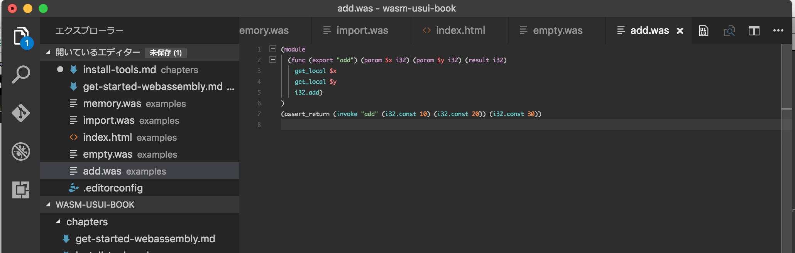

# Install Tools

WebAssemblyを書くためのツールをインストールします。
バイナリを直接書ける猛者以外はインストールをお勧めします。

## wabt

WebAssemblyのテキスト表現からバイナリ表現(または逆)へ変換したり、バイトコードのdumpや詳細情報を可視化したりするツールがcliとして提供されています。

* wast2wasm
* wasm2wast
* wasm-interp
* wast-desuger

## Visual Studio Code + vscode-wast

個人的にWebAssemblyのテキスト表現を編集するためのvscode拡張を作りましたのでサンプルコードを書くときはVisual Studio Codeを使うことをおすすめします。

1. https://code.visualstudio.com/からVisual Studio Code本体をダウンロードしてインストールします。
2. ⌘+P でコマンドパレットを開いて`ext install wast`と入力してEnterでvscode-wastがインストールされます。

インストール後の編集画面

