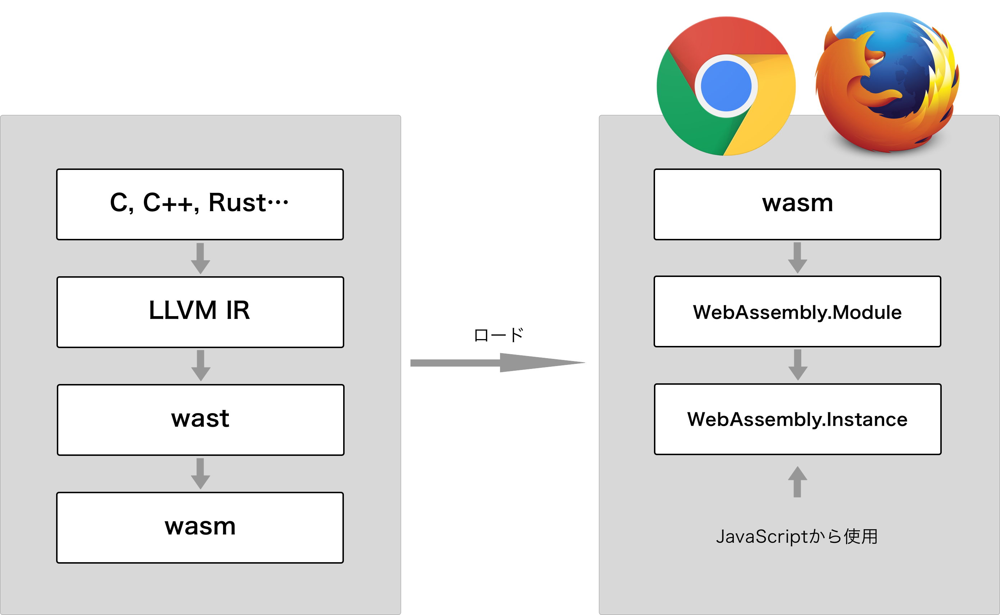

# WebAssemblyとは

https://developer.mozilla.org/en-US/docs/WebAssembly/Concepts から引用すると、

> WebAssemblyはモダンなWebブラウザで実行できる新しいタイプのコードで、新しい機能とパフォーマンスの大幅な向上をもたらします。基本的には、手書きではなく、C、C++、Rustなどの低レベルな言語からのコンパイル対象となるように設計されています。
>
> WebAssemblyはWebプラットフォームに大きな影響を与えます。複数の言語で書かれたコードをWeb上でネイティブに近い速度で実行する方法を提供します。
> 
> さらに、WebAssemblyの作成方法を知らなくても恩恵を受けることができます。WebAssemblyモジュールをWeb（またはNode.js）アプリケーションにインポートして、WebAssemblyの関数をJavaScriptから使用することができます。JavaScriptフレームワークではWebAssemblyによってパフォーマンス向上や新機能を提供しながら、Web開発者は簡単に機能を利用することができます。

## 現状できること（Minimum Viable Product）

WebAssemblyは必要最低限の機能（英語だとMinimum Viable Product、以下MVPと記述）だけを持ってリリースされました。大まかにはasm.jsと同等のことができて、具体的には以下のような機能を利用することができます。

* WebAssemblyモジュールのソースコード（バイナリ）をJS APIを用いてコンパイルし、ブラウザのJS環境上で動かすことができます。
* 64bit整数やJSにはない低レベルの命令がサポートされています。
* 変数、関数、線形メモリー、テーブル（参照を要素として持つ型付き配列で、現状は関数だけ）がサポートされています。
* 上の機能に対してインポート、エクスポートするための仕組みが存在します。

## 将来的な機能

外部ツールの拡充、スレッド、SIMD、GC/DOM/Web APIの統合など、いつ実装されるかわかりませんが夢のある機能が控えています[^future features]。

## バイナリ表現とテキスト表現

WebAssemblyの内容はバイナリで表現されますが、人が読んだりデバッグしたり、または直接書くためのテキスト表現が存在します。本書では、そのテキスト表現を多用します。ただし、現状使われているテキスト表現の仕様は最終決定されたものではないので、本書のサンプルコードが使用できなくなる可能性があります。

以下、バイナリ表現をwasm、テキスト表現をwastと表記します。

## Webブラウザで実行されるまで

まずは、C、C++、Rust言語などからemscripten経由[^emcc to wasm][^rust to wasm]で、もしくはwastから直接変換するかしてサーバー上にwasmを設置します。次にブラウザからwasmをダウンロードし、`WebAssembly.compile`を用いてモジュールにコンパイルし、それを`WebAssembly.instantiate`を用いて実行可能なインスタンスを生成してようやくJS環境上で動かすことができます。emscripten経由で変換された場合はそのあたりの面倒な部分をJSやhtmlに埋め込んでくれるので、ちょっと試すだけならこちらのほうが楽です。

## ロゴ

WebAssemblyのロゴは、色々なものが提案されて、その中から投票によって決定されました。ロゴのライセンスはCC0です。

* [^future features]: [Features to add after the MVP \- WebAssembly](http://webassembly.org/docs/future-features/)
* [^emcc to wasm]: [WebAssembly Standalone · kripken/emscripten Wiki](https://github.com/kripken/emscripten/wiki/WebAssembly-Standalone)
* [^rust to wasm]: [Compiling to the web with Rust and emscripten \- The Rust Programming Language Forum](https://users.rust-lang.org/t/compiling-to-the-web-with-rust-and-emscripten/7627)
